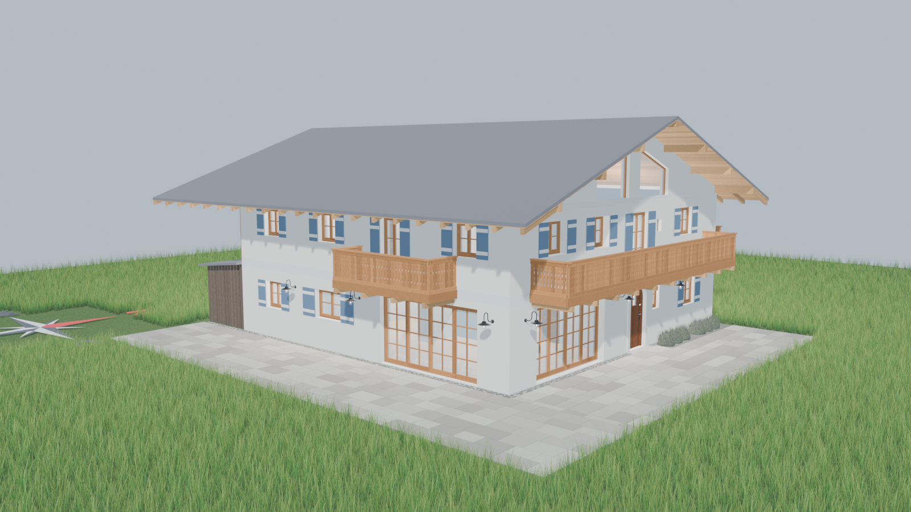
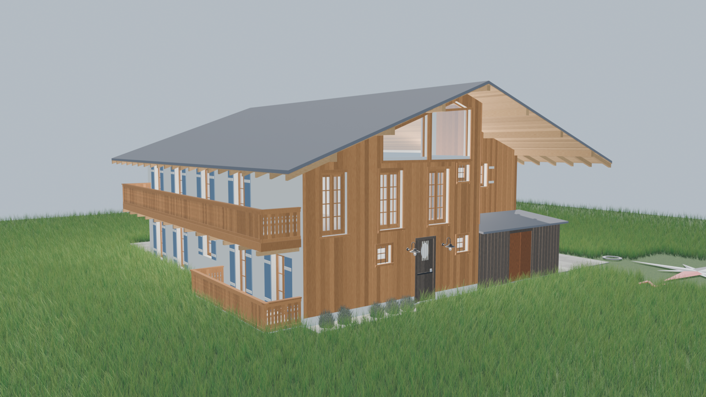

# Frechenlehen – Blender-Modell

3D-Modell des Hauses, erzeugt aus den ALLPLAN-Plänen (Grundriss EG/OG, Ansichten, M 1:100).

## Struktur

| Pfad | Inhalt |
|---|---|
| `input/` | Eingangsdaten: die 3 PDFs, daraus gerenderte Grundriss-Bilder (`grundriss_eg/og.png`, im Modell als ausgeblendete Referenz), Farbvorlagen (`farben_*.png`), Detailfotos (Dateiname = Bauteil, z. B. `entrance_door_from_outside.png`) |
| `code/` | Python-Skripte, laufen in Blender (z. B. über den Blender-MCP-Server) |
| `frechenlehen.blend` | das Modell |
| `frechenlehen_rundgang.mp4` | Film: Rundgang außen, dann EG und OG |
| `docs/images/` | Ansichten für dieses README |
| `tmp/` | Zwischenstände (Einzelbilder, Testrender, Logs) – kann gelöscht werden |

## Skripte (`code/`)

| Skript | Macht |
|---|---|
| `build_house.py` | baut das Haus komplett neu (Collection „Haus“), inkl. Details nach den Fotos: Rundbogen-Haustür, Hintertür mit Ovalfenster, Stuben-Nische mit Segmentbogen, Kassettentüren innen (geöffnet), Fenster mit Lärchenrahmen und Sprossen, Terrassentüren (und die großen Westfenster) in Lärche, Lärchenschalung der ganzen Westseite, Balkone in Lärche mit Baluster-Ausschnitten, Treppe mit gedrechseltem Geländer (auch um das Treppenloch im OG), Sparren/Pfetten und Untersicht, Granit-Terrasse mit Kiesstreifen und Beeten, Außenleuchten. **Achtung:** überschreibt Handänderungen im Modell |
| `paint.py` | Farben (Putz/Fenster RAL 9010, Läden RAL 5014; Türen bleiben Naturholz) und weiße Querbretter an den Läden – nach `build_house.py` erneut ausführen |
| `windrose.py` | Windrose (eigene Collection, bleibt bei Neubau erhalten) |
| `garden.py` | Wiese (Geometry-Nodes-Streuung, im Viewport 10 %) und Lavendel in den Beeten (eigene Collection „Garten“) – nach `build_house.py` erneut ausführen |
| `film.py` | Kamerafahrt, Raumlichter, geöffnete Haustür; Renderausgabe nach `tmp/film/` |

Ausführen in Blender: `exec(open("/Users/tgartner/git/frechen_blender/code/<skript>.py").read())`
Reihenfolge beim Neubau: `build_house` → `paint` → `windrose` → `garden` → `film`.

Koordinaten: Ursprung = äußere SW-Ecke, +X = Osten, +Y = Norden, Meter.
