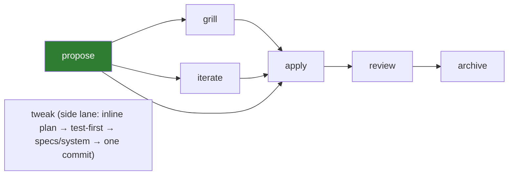

# Spec workflow — current step

No open changes: the next step is `propose` (or `tweak` for a small change).

```mermaid
flowchart LR
    propose --> grill & iterate --> apply --> review --> archive
    propose --> apply
    tweak["tweak (side lane: inline plan → test-first → specs/system → one commit)"]
    style propose fill:#2e7d32,color:#fff
```
